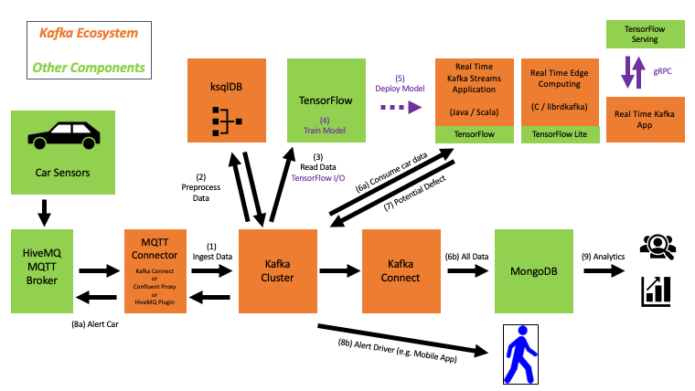
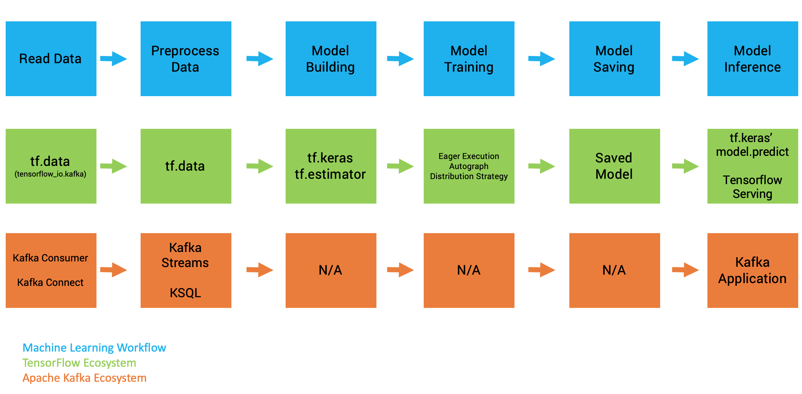
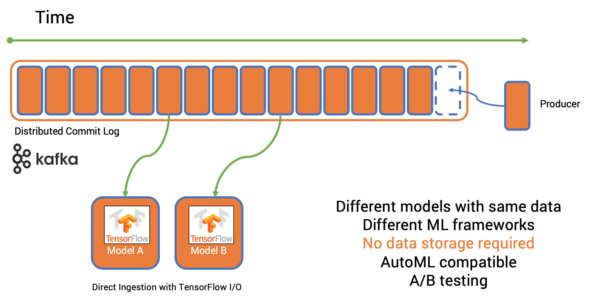

# Streaming Machine Learning from IoT Devices with HiveMQ, Apache Kafka and TensorFLow

WORK IN PROGRESS... NO FUNCTIONAL PROJECT YET...

This project implements a scenario where you can *train new analytic models from streaming data - without the need for an additional data store* like S3, HDFS or Spark.

We use HiveMQ as open source MQTT broker to ingest data from IoT devices, ingest the data in real time into an Apache Kafka cluster for preprocessing (using Kafka Streams / KSQL), and model training (using TensorFlow 2.0 and its Kafka IO plugin).

## Use Case and Architecture

Streaming Machine Learning with MQTT, Kafka and TensorFlow I/O:

- Data Integration and Preprocessing
- Model Training
- Model Deployment
- Real Time Scoring
- Real Time Monitoring

## Streaming Ingestion and Model Training with Kafka and TensorFlow-IO

Typically, analytic models are trained in batch mode where you first ingest all historical data in a data store like HDFS, AWS S3 or GCS. Then you train the model using a framework like Spark MLlib, TensorFlow or Google ML.

[TensorFlow I/O](https://github.com/tensorflow/io) is a component of the TensorFlow framework which allows native integration with different technologies.

One of these integrations is tensorflow_io.kafka which allows streaming ingestion into TensorFlow from Kafka WITHOUT the need for a data store! This *significantly simplifies the architecture  and reduces operation and development costs*.
Yong Tang, member of the SIG TensorFlow I/O team, did a [great presentation about this at Kafka Summit 2019 in New York](https://www.confluent.io/kafka-summit-ny19/real-time-streaming-with-kafka-and-tensorflow) (video and slide deck available for free).

You can pick and choose the right components from the Apache Kafka and TensorFlow ecosystems for your use case:

This demo will do the following steps:

- Consume streaming data from MQTT Broker HiveMQ via a Kafka Consumer
- Preprocess the data with KSQL (filter, transform)
- Ingest the data into TensorFlow  (tf.data and tensorflow-io)
- Build, train and save the model  (TensorFlow 2.0 API)
- Deploy the model within a Kafka Streams application for embedded real time scoring

Optional steps (nice to have)

- Show IoT-specific features with HiveMQ tool stack
- Deploy the model via TensorFlow Serving
- Some kind of A/B testing
- Re-train the model and updating the Kafka Streams application (via sending the new model to a Kafka topic)
- Monitoring of model training (via TensorBoard) and model deployment / inference (via some kind of Kafka integration + dashboard technology)
- Confluent Cloud for Kafka as a Service (-> Focus on business problems, not running infrastructure)
- Enhance demo with C / librdkafka clients and TensorFlow Lite for edge computing
- todo - other ideas?

## Why is this so awesome

Again, you don't need another data store anymore! Just ingest the data directly from the distributed commit log of Kafka:

## Be aware: This is still NOT Online Training

Streaming ingestion for model training is fantastic. You don't need a data store anymore. This simplifies the architecture and reduces operations and developemt costs.

However, one common misunderstanding has to be clarified - as this question comes up every time you talk about TensorFlow I/O and Apache Kafka: As long as machine learning / deep learning frameworks and algorythms expect data in batches, you cannot achieve real online training (i.e. re-training / optimizing the model with each new input event).

Only a few algoryhtms and implementations are available today, like Online Clustering.

Thus, even with TensorFlow I/O and streaming ingestion via Apache Kafka, you still do batch training. Though, you can configure and optimize these batches to fit your use case. Additionally, only Kafka allows ingestion at large scale for use cases like connected cars or assembly lines in factories. You cannot build a scalable, reliable, mission-critical ML infrastructure just with Python.

The combination of TensorFlow I/O and Apache Kafka is a great step closer to real time training of analytic models at scale!

I posted many articles about videos about this discussion. Get started with [How to Build and Deploy Scalable Machine Learning in Production with Apache Kafka](https://www.confluent.io/blog/build-deploy-scalable-machine-learning-production-apache-kafka/) and check out my other resources if you want to learn more.

## Requirements and Installation

TODO

## Live Demo

Until the demo is ready, you can already checkout a working [Python example of streaming ingestion of MNIST data into TensorFlow via Kafka](confluent-tensorflow-io-kafka.py).

TODO IMPLEMENT DEMO

(via Docker container and run via single command)

- Start HiveMQ
- Start Confluent Platform
- Start TensorFlow Python script consuming data to train the model
- Create data stream (MQTT messages)
- Finish model training
- Use model for inference: 1) via TensorFlow-IO Python API, 2) exported to a Kafka Streams / KSQL microservice and 3) via TensorFlow Serving

## More Information

### TensorFlow 1.x to 2.0 Migration and Embedded Keras API

- The upgrade tool allows smooth migration, especially if your TensorFlow 1.x code also uses Keras. I just executed: "tf_upgrade_v2 --infile Python-Tensorflow-1.x-Keras-Fraud-Detection-Autoencoder.ipynb --outfile Python-Tensorflow-2.0-Keras-Fraud-Detection-Autoencoder.ipynb"
- Python-Tensorflow-1.x-Keras-Fraud-Detection-Autoencoder.ipynb is the initial Jupyter Notebook to create the autoencoder
- Python-Tensorflow-2.0-Keras-Fraud-Detection-Autoencoder.ipynb is the TensorFlow 2.0 version
- You usually still need to do some custom fixes. My migration report had no errors, but I still has to replace "tensorflow.keras" with "keras" imports (and uninstall the independent Keras package via pip to be on the safe path)
- The Jupyter Notebook now runs well with TensorFlow 2.0 and its embedded Keras API